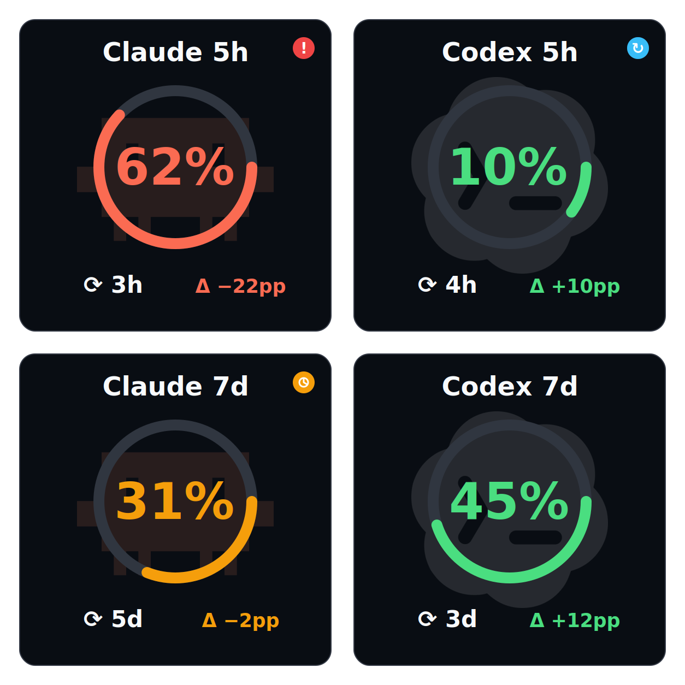
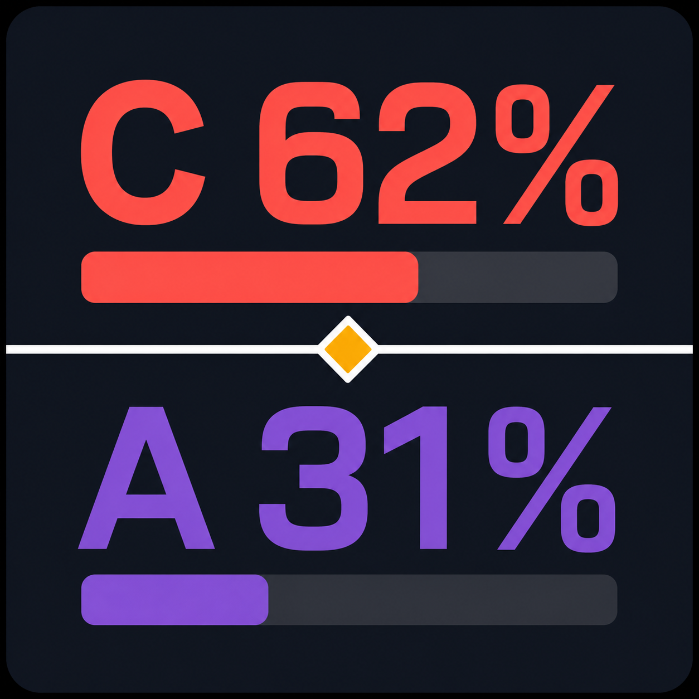
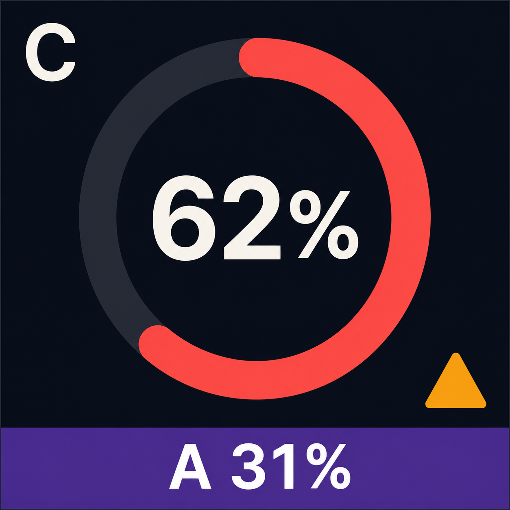
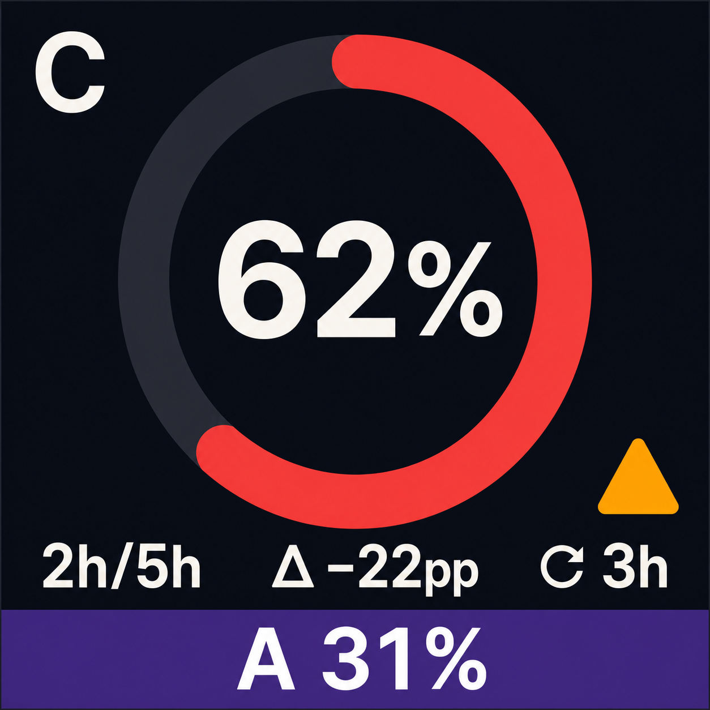
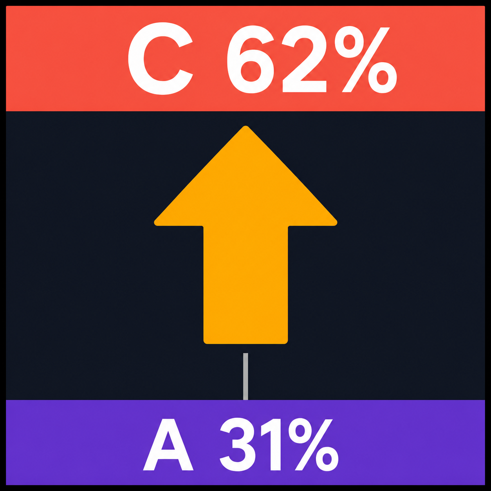

# Dual-window Stream Deck indicator prototype

> Throwaway visual prototype for the map ticket **Prototype readable dual-window Stream Deck indicators**. It asks which information hierarchy is most legible on a Stream Deck key; it is not production artwork or an implementation specification.

Each bitmap is rendered at high resolution for review, but deliberately uses only the large shapes and labels intended to survive a 72×72 px Stream Deck key.

## Selected direction — four usage tiles

The layout uses four keys, not a combined provider summary:

| Key | Usage window |
| --- | --- |
| Claude Code 5h | Claude Code short-term usage window |
| Codex 5h | Codex short-term usage window |
| Claude Code 7d | Claude Code long-term usage window |
| Codex 7d | Codex long-term usage window |

Every **usage tile** has the same independent reading order: provider and window in its header, usage progress in the ring, a reset countdown, and pace delta. There is no second provider or second usage window on a tile. The raw elapsed/duration value is intentionally omitted because pace delta already compares elapsed time with usage progress.

Provider identity is a low-contrast **provider accent** behind the information, not a status colour: Claude Code uses the orange robot mark and Codex uses the app mark. The SVG places their dark LobeHub assets from `provider-icons/` at the exact center of each tile, sourced from [Claude Code](https://lobehub.com/icons/claudecode) and [Codex](https://lobehub.com/icons/codex).

The **pace accent** colors the progress ring, large usage-progress value, and pace delta together: green means the usage progress is behind elapsed time; amber/coral means it is ahead of elapsed time. This makes the urgent distinction visible without reading the delta.

The SVG also previews an operational badge in the top-right corner: red exclamation for an error, pulsating blue reset mark while window keeping is active, amber clock for stale data, and no badge for a normal tile.

The values in the mockup are illustrative. For example, `↻ 3h` and `Δ −22pp` mean that the usage window resets in three hours and usage progress is 22 percentage points ahead of elapsed time.

## Rejected combined-key directions

## A — Split Ledger

Two equal bands make Codex (`C`) and Claude (`A`) directly comparable. The central amber diamond is the single pace-status signal.

## B — Radial Sentinel

The currently most urgent provider gets the entire key; the other provider remains a small bottom strip. This favors immediate action over balanced comparison.

## D — Radial Sentinel with time and pace delta

This revision keeps the urgent provider as the primary radial reading while exposing three independent facts: usage progress, reset time, and elapsed-time comparison. The illustrative state is 62% usage after 2h of a 5h usage window, resetting in 3h; its pace delta is `−22 pp` because 40% of the window has elapsed while 62% has been consumed.

## C — Pace Beacon

The pace-status arrow dominates the key, with the two provider values as bands. This favors an at-a-glance warning over accurate progress comparison.

## Validated outcome

The four-key composition, reading order (progress → reset countdown → pace delta), provider accents, pace accents, and operational badges are accepted. This prototype now supplies the visual direction for implementation.
